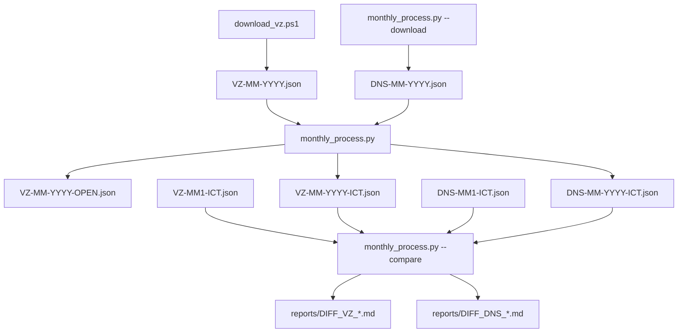

# Struktura souborů projektu ISVZ

## 📂 Přehled adresářů

```
ISVZ/
├── data/                           # 💾 Datové soubory (ne v Git)
│   ├── VZ/                             # Veřejné zakázky
│   │   ├── VZ-MM-YYYY.json
│   │   ├── VZ-MM-YYYY-OPEN.json
│   │   └── VZ-MM-YYYY-ICT.json
│   ├── DNS/                            # Dynamické nákupní systémy
│   │   ├── DNS-MM-YYYY.json
│   │   └── DNS-MM-YYYY-ICT.json
│   ├── SON/                            # Soutěže o návrh
│   ├── SK/                             # Systémy kvalifikace
│   └── RVP/                            # Výběr poddodavatelů
│
├── output/                         # 📊 Generované výstupy
│   ├── ciselniky/
│   │   ├── isvz_ciselniky.json
│   │   └── isvz_ciselniky.md (viz docs/)
│   └── reports/
│       ├── DIFF_VZ_*.md
│       └── DIFF_DNS_*.md
│
├── scripts/                        # 🔧 Aktivní skripty
├── docs/                           # 📖 Dokumentace
├── archive/                        # 📦 Staré skripty
└── [root soubory]                  # README, monthly_process.py, download_vz.ps1
```
├── reports/                # 📊 Rozdílové reporty
│   ├── DIFF_VZ_MM1-YY1_vs_MM2-YY2.md
│   └── DIFF_DNS_MM1-YY1_vs_MM2-YY2.md
│
└── [skripty a dokumentace] # Viz níže
```

## 🔧 Hlavní skripty

### Měsíční zpracování

| Soubor | Účel | Použití |
|--------|------|---------|
| **monthly_process.py** | 🎯 Orchestrace celého procesu | `python monthly_process.py --year 2026 --month 1` |
| **download_vz.ps1** | 📥 Stahování velkých VZ souborů | `.\download_vz.ps1 -Year 2026 -Month 1` |

### Filtrování

| Soubor | Účel | Vstup | Výstup |
|--------|------|-------|--------|
| **filter_open_tenders.py** | 🔍 Filtruje otevřené VZ zakázky | data/VZ/VZ-MM-YYYY.json | data/VZ/VZ-MM-YYYY-OPEN.json |
| **filter_ict_tenders.py** | 💻 Filtruje ICT z VZ | data/VZ/VZ-MM-YYYY-OPEN.json | data/VZ/VZ-MM-YYYY-ICT.json |
| **filter_dns_ict.py** | 💻 Filtruje ICT z DNS | data/DNS/DNS-MM-YYYY.json | data/DNS/DNS-MM-YYYY-ICT.json |

### Zobrazení

| Soubor | Účel |
|--------|------|
| **show_ict_tenders.py** | 📋 Zobrazí přehled ICT zakázek |

### Analýza struktury

| Soubor | Účel | Výstup |
|--------|------|--------|
| **analyze_structure.py** | 🔍 Analyzuje strukturu JSON | - |
| **analyze_states.py** | 📊 Analyzuje stavy zakázek | isvz_stavy_filtrovani.md |

## 📖 Dokumentace

| Soubor | Obsah |
|--------|-------|
| **README.md** | 📘 Hlavní návod k použití |
| **MONTHLY_README.md** | 🔄 Návod pro měsíční automatizaci |
| **isvz_datamodel.md** | 📚 Kompletní datový model ISVZ |
| **isvz_stavy_filtrovani.md** | 📊 Analýza stavů a kritérií filtrování |

## 🗂️ Staré/Debug skripty

Tyto soubory jsou ze starších verzí nebo pro debugging:

| Soubor | Status | Poznámka |
|--------|--------|----------|
| analyze_isvz_robust.py | ⚠️ Zastaralé | Původní analytický skript |
| analyze_isvz.py | ⚠️ Zastaralé | První verze |
| debug_*.py | 🔧 Debug | Pro ladění |
| transform_to_md.py | 🔧 Pomocný | Transformace do MD |
| ict_zakazky_report.md | 📄 Výstup | Starý report |

## 🎯 Pracovní workflow

### 1️⃣ Jednorázové použití (VZ)


### 1️⃣b DNS filtrování


### 2️⃣ Měsíční proces (integrovaný)



## 📋 Checklist pro nový měsíc

- [ ] Stáhnout VZ soubor: `.\download_vz.ps1 -Year YYYY -Month MM`
- [ ] Stáhnout ostatní: `python monthly_process.py --year YYYY --month MM --download`
- [ ] Zpracovat: `python monthly_process.py --year YYYY --month MM`
- [ ] Porovnat: `python monthly_process.py --compare YYYY1 MM1 YYYY2 MM2`
- [ ] Zkontrolovat reporty v `reports/DIFF_VZ_*.md` a `reports/DIFF_DNS_*.md`
- [ ] Zpracovat: `python monthly_process.py --year YYYY --month MM`
- [ ] Porovnat: `python monthly_process.py --compare YYYY1 MM1 YYYY2 MM2`
- [ ] Zkontrolovat reports/DIFF_*.md
- [ ] Archivovat staré měsíce (volitelné)

## 🔍 Jak najít co potřebuju?

| Potřebuji... | Použij |
|--------------|--------|
| Zpracovat nový měsíc | `monthly_process.py` |
| Stáhnout velký soubor | `download_vz.ps1` |
| Jen filtrovat ICT | `filter_ict_tenders.py` |
| Zobrazit výsledky | `show_ict_tenders.py` |
| Porozumět datům | `isvz_datamodel.md` |
| Měsíční automatizace | `MONTHLY_README.md` |
| Upravit kritéria ICT | Edituj `filter_ict_tenders.py` → `ICT_KEYWORDS` |
| Upravit kritéria otevřených | Edituj `filter_open_tenders.py` → `is_open_tender()` |

## 💾 Velikosti souborů

| Typ | Typická velikost |
|-----|------------------|
| VZ-MM-YYYY.json | 800 MB - 1.3 GB |
| VZ-MM-YYYY-OPEN.json | 20-30 MB |
| VZ-MM-YYYY-ICT.json | 1-5 MB |
| DIFF_*.md | 50-500 KB |

## 🚀 Rychlé příkazy

```bash
# Zpracovat leden 2026
python monthly_process.py --year 2026 --month 1

# Porovnat prosinec vs leden
python monthly_process.py --compare 2025 12 2026 1

# Zobrazit výsledky
python show_ict_tenders.py

# Stáhnout únor 2026
.\download_vz.ps1 -Year 2026 -Month 2
python monthly_process.py --year 2026 --month 2 --download
```

---

*Verze: 1.0*  
*Aktualizováno: 7. února 2026*
