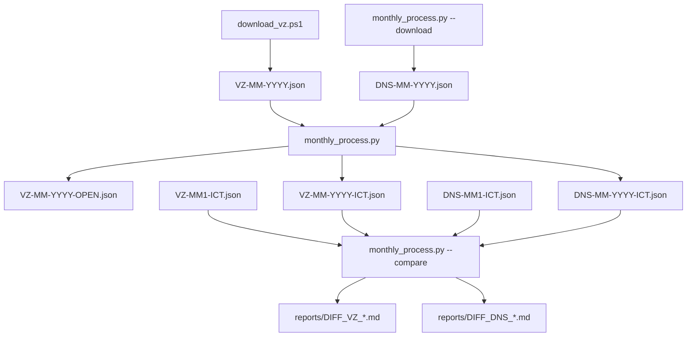

# Struktura projektu ISVZ

Přehled aktivních souborů a složek pro měsíční zpracování veřejných zakázek.

## 📂 Struktura adresářů

```
ISVZ/
├── 📄 README.md                    # Hlavní dokumentace
├── 📄 QUICKSTART.md                # ⭐ Rychlý start pro nové uživatele
├── 🔄 monthly_process.py           # Orchestrace měsíčního zpracování
├── 📥 download_vz.ps1              # PowerShell skript pro stahování VZ
│
├── 📁 scripts/                     # 🔧 Aktivní skripty (používané monthly_process.py)
│   ├── filter_open_tenders.py          # Krok 1: Filtrování otevřených VZ
│   ├── filter_ict_tenders.py           # Krok 2: Filtrování ICT z VZ
│   ├── filter_dns_ict.py               # Krok 3: Filtrování ICT z DNS
│   ├── add_recommendations.py          # Krok 4: Přidání doporučení (1-5)
│   └── generate_reports.py             # Krok 5: Generování MD + CSV reportů
│
├── 📁 docs/                        # 📖 Aktivní dokumentace
│   ├── MONTHLY_README.md               # Měsíční workflow
│   ├── REPORT_GENERATION.md            # Popis CSV a MD reportů (32 sloupců)
│   ├── DOPORUCOVACI_SYSTEM.md          # Systém hodnocení (1-5)
│   ├── POROVNANI_MESICU.md             # Rozdílové reporty
│   ├── EXCEL_INTEGRACE.md              # Práce s CSV v Excelu
│   ├── CISELNIKY_PREHLED.md            # Přehled číselníků
│   ├── NUTS_KRAJE.md                   # Číselník NUTS → Kraje
│   └── FILE_STRUCTURE.md               # Tento soubor
│
├── 📁 data/                        # 💾 Datové soubory (ne v Git)
│   ├── VZ/                             # Veřejné zakázky
│   │   ├── VZ-YYYY-MM.json                 # Originál (~1.3 GB)
│   │   ├── VZ-YYYY-MM-OPEN.json            # Otevřené (~30 MB)
│   │   └── VZ-YYYY-MM-ICT.json             # ICT s doporučením (~4 MB)
│   ├── DNS/                            # Dynamické nákupní systémy
│   │   ├── DNS-YYYY-MM.json                # Originál (~3 MB)
│   │   └── DNS-YYYY-MM-ICT.json            # ICT (~200 KB)
│   ├── SON/                            # Soutěže o návrh
│   ├── SK/                             # Systémy kvalifikace
│   └── RVP/                            # Výběr poddodavatelů
│
├── 📁 output/                      # 📊 Generované výstupy
│   ├── reports/                        # Markdown reporty
│   │   ├── VZ-ICT_YYYY-MM.md               # ⭐ Tabulkový souhrn (nejnovější)
│   │   ├── VZ-OPEN_YYYY-MM.md              # ⭐ Tabulkový souhrn (nejnovější)
│   │   ├── DNS-ICT_YYYY-MM.md              # ⭐ Tabulkový souhrn (nejnovější)
│   │   ├── DIFF_VZ_MM-YYYY.md              # Rozdílový report VZ
│   │   ├── DIFF_DNS_MM-YYYY.md             # Rozdílový report DNS
│   │   └── YYYY/MM/                        # Detailní měsíční reporty
│   │       ├── VZ-OPEN_YYYY-MM.md
│   │       ├── VZ-ICT_YYYY-MM.md
│   │       └── DNS-ICT_YYYY-MM.md
│   └── csv/                            # CSV exporty
│       ├── VZ-ICT.csv                      # ⭐ Nejnovější (pro Excel)
│       ├── VZ-OPEN.csv                     # ⭐ Nejnovější (pro Excel)
│       ├── DNS-ICT.csv                     # ⭐ Nejnovější (pro Excel)
│       └── YYYY/MM/                        # CSV archiv
│           ├── VZ-OPEN_YYYY-MM.csv
│           ├── VZ-ICT_YYYY-MM.csv
│           └── DNS-ICT_YYYY-MM.csv
│
└── 📁 archive/                     # 📦 Historické/utility soubory
    ├── docs/                           # Jednou použité analýzy
    │   ├── isvz_datamodel.md               # Počáteční analýza dat
    │   ├── isvz_stavy_filtrovani.md        # Analýza stavů
    │   ├── isvz_ciselniky.md               # Kompletní číselníky
    │   ├── CATEGORY_ANALYSIS.md            # Analýza kategorií
    │   ├── DOPORUCENA_NEVYUZITA_POLE.md    # Analýza polí
    │   └── NAMING_CONVENTION_CHANGE.md     # Historie změny názvů
    └── scripts/                        # Utility skripty
        ├── show_ict_tenders.py             # Konzolový view
        ├── extract_codebooks.py            # Extrakce číselníků
        ├── explore_other_categories.py     # Analýza kategorií
        └── analyze_unused_fields.py        # Analýza JSON polí
```

## 🔄 Workflow měsíčního zpracování

```
┌─────────────────┐
│  1. STAHOVÁNÍ   │  download_vz.ps1 + monthly_process.py --download
└────────┬────────┘
         │
         ▼
┌─────────────────────────────────────────────────────────────┐
│  2. ZPRACOVÁNÍ (monthly_process.py)                         │
│                                                              │
│  ┌──────────────────────────────────────────────────────┐  │
│  │ Krok 1: filter_open_tenders.py                       │  │
│  │         VZ → VZ-OPEN (970 zakázek)                   │  │
│  └──────────────────────────────────────────────────────┘  │
│           │                                                  │
│           ▼                                                  │
│  ┌──────────────────────────────────────────────────────┐  │
│  │ Krok 2: filter_ict_tenders.py                        │  │
│  │         VZ-OPEN → VZ-ICT (145 zakázek)               │  │
│  └──────────────────────────────────────────────────────┘  │
│           │                                                  │
│           ▼                                                  │
│  ┌──────────────────────────────────────────────────────┐  │
│  │ Krok 3: filter_dns_ict.py                            │  │
│  │         DNS → DNS-ICT (14 zakázek)                   │  │
│  └──────────────────────────────────────────────────────┘  │
│           │                                                  │
│           ▼                                                  │
│  ┌──────────────────────────────────────────────────────┐  │
│  │ Krok 4: add_recommendations.py                       │  │
│  │         Přidá doporučení 1-5 ⭐                       │  │
│  └──────────────────────────────────────────────────────┘  │
│           │                                                  │
│           ▼                                                  │
│  ┌──────────────────────────────────────────────────────┐  │
│  │ Krok 5: generate_reports.py                          │  │
│  │         Vytvoří MD + CSV reporty                     │  │
│  └──────────────────────────────────────────────────────┘  │
└─────────────────────────────────────────────────────────────┘
         │
         ▼
┌─────────────────┐
│  3. POROVNÁNÍ   │  monthly_process.py --compare
└─────────────────┘
```

## 📋 Klíčové soubory

### Spustitelné skripty

| Soubor | Účel | Použití | Doporučení |
|--------|------|---------|------------|
| **run_monthly.ps1** | ⭐ **Kompletní workflow (PowerShell)** | `.\run_monthly.ps1` | **NEJJEDNODUŠŠÍ!** |
| **run_monthly.bat** | ⭐ **Kompletní workflow (Batch)** | Dvojklik nebo `run_monthly.bat` | Pro uživatele bez PowerShell |
| **monthly_process.py** | 🎯 Python orchestrace | `python monthly_process.py --year 2026 --month 2` | Pokročilé použití |
| **download_vz.ps1** | 📥 Stahování velkých VZ | `.\download_vz.ps1 -Year 2026 -Month 2` | Manuální stahování |

**Nové řídící skripty (run_monthly):**
- Automaticky stáhnou, zpracují a porovnají data
- Barevný výstup a průběžné info
- Statistiky a cesty k výstupům
- Jeden příkaz = celý měsíční proces!

### Dokumentace pro uživatele

| Soubor | Pro koho | Obsah |
|--------|----------|-------|
| **QUICKSTART.md** | 🆕 Nové uživatele | Rychlý start, základní workflow |
| **README.md** | Všechny | Kompletní přehled projektu |
| **MONTHLY_README.md** | Pravidelné používání | Detailní měsíční workflow |
| **REPORT_GENERATION.md** | Analýza dat | Struktura CSV (32 sloupců), MD reportů |
| **DOPORUCOVACI_SYSTEM.md** | Práce s doporučením | Jak funguje hodnocení 1-5 |
| **EXCEL_INTEGRACE.md** | Excel uživatele | Import CSV, filtry, kontingenční tabulky |

## 🎯 Výstupní soubory

### Nejdůležitější výstupy (pro pravidelnou práci)

```
output/csv/
├── VZ-ICT.csv         ← ⭐ ZAČNI TADY (Excel ready)
├── VZ-OPEN.csv        ← Všechny otevřené zakázky
└── DNS-ICT.csv        ← ICT z dynamických systémů

output/reports/
├── VZ-ICT_2026-02.md  ← ⭐ Tabulkový souhrn
└── DIFF_VZ_02-2026.md ← Co je nového
```

### Archiv (historie)

```
output/csv/2026/02/    ← CSV s datem (archiv)
output/reports/2026/02/ ← Detailní MD reporty
```

## 💡 Poznámky

**Soubory v Git:**
- ✅ README, dokumentace, skripty
- ❌ data/ - příliš velké
- ❌ output/ - generované
- ❌ __pycache__/ - Python cache

**Jmenná konvence:**
- Formát: `KATEGORIE-YYYY-MM.json`
- Přípony: `-OPEN`, `-ICT` pro vyfiltrované
- Výhoda: Chronologické řazení

**Archiv:**
- Obsahuje historické analýzy a utility
- Není nutné pro běžnou práci
- Ponecháno pro referenci
|--------|------|-------|--------|
| **filter_open_tenders.py** | 🔍 Filtruje otevřené VZ zakázky | data/VZ/VZ-MM-YYYY.json | data/VZ/VZ-MM-YYYY-OPEN.json |
| **filter_ict_tenders.py** | 💻 Filtruje ICT z VZ | data/VZ/VZ-MM-YYYY-OPEN.json | data/VZ/VZ-MM-YYYY-ICT.json |
| **filter_dns_ict.py** | 💻 Filtruje ICT z DNS | data/DNS/DNS-MM-YYYY.json | data/DNS/DNS-MM-YYYY-ICT.json |

### Zobrazení

| Soubor | Účel |
|--------|------|
| **show_ict_tenders.py** | 📋 Zobrazí přehled ICT zakázek |

### Analýza struktury

| Soubor | Účel | Výstup |
|--------|------|--------|
| **analyze_structure.py** | 🔍 Analyzuje strukturu JSON | - |
| **analyze_states.py** | 📊 Analyzuje stavy zakázek | isvz_stavy_filtrovani.md |

## 📖 Dokumentace

| Soubor | Obsah |
|--------|-------|
| **README.md** | 📘 Hlavní návod k použití |
| **MONTHLY_README.md** | 🔄 Návod pro měsíční automatizaci |
| **isvz_datamodel.md** | 📚 Kompletní datový model ISVZ |
| **isvz_stavy_filtrovani.md** | 📊 Analýza stavů a kritérií filtrování |

## 🗂️ Staré/Debug skripty

Tyto soubory jsou ze starších verzí nebo pro debugging:

| Soubor | Status | Poznámka |
|--------|--------|----------|
| analyze_isvz_robust.py | ⚠️ Zastaralé | Původní analytický skript |
| analyze_isvz.py | ⚠️ Zastaralé | První verze |
| debug_*.py | 🔧 Debug | Pro ladění |
| transform_to_md.py | 🔧 Pomocný | Transformace do MD |
| ict_zakazky_report.md | 📄 Výstup | Starý report |

## 🎯 Pracovní workflow

### 1️⃣ Jednorázové použití (VZ)


### 1️⃣b DNS filtrování


### 2️⃣ Měsíční proces (integrovaný)



## 📋 Checklist pro nový měsíc

- [ ] Stáhnout VZ soubor: `.\download_vz.ps1 -Year YYYY -Month MM`
- [ ] Stáhnout ostatní: `python monthly_process.py --year YYYY --month MM --download`
- [ ] Zpracovat: `python monthly_process.py --year YYYY --month MM`
- [ ] Porovnat: `python monthly_process.py --compare YYYY1 MM1 YYYY2 MM2`
- [ ] Zkontrolovat reporty v `reports/DIFF_VZ_*.md` a `reports/DIFF_DNS_*.md`
- [ ] Zpracovat: `python monthly_process.py --year YYYY --month MM`
- [ ] Porovnat: `python monthly_process.py --compare YYYY1 MM1 YYYY2 MM2`
- [ ] Zkontrolovat reports/DIFF_*.md
- [ ] Archivovat staré měsíce (volitelné)

## 🔍 Jak najít co potřebuju?

| Potřebuji... | Použij |
|--------------|--------|
| Zpracovat nový měsíc | `monthly_process.py` |
| Stáhnout velký soubor | `download_vz.ps1` |
| Jen filtrovat ICT | `filter_ict_tenders.py` |
| Zobrazit výsledky | `show_ict_tenders.py` |
| Porozumět datům | `isvz_datamodel.md` |
| Měsíční automatizace | `MONTHLY_README.md` |
| Upravit kritéria ICT | Edituj `filter_ict_tenders.py` → `ICT_KEYWORDS` |
| Upravit kritéria otevřených | Edituj `filter_open_tenders.py` → `is_open_tender()` |

## 💾 Velikosti souborů

| Typ | Typická velikost |
|-----|------------------|
| VZ-MM-YYYY.json | 800 MB - 1.3 GB |
| VZ-MM-YYYY-OPEN.json | 20-30 MB |
| VZ-MM-YYYY-ICT.json | 1-5 MB |
| DIFF_*.md | 50-500 KB |

## 🚀 Rychlé příkazy

```bash
# Zpracovat leden 2026
python monthly_process.py --year 2026 --month 1

# Porovnat prosinec vs leden
python monthly_process.py --compare 2025 12 2026 1

# Zobrazit výsledky
python show_ict_tenders.py

# Stáhnout únor 2026
.\download_vz.ps1 -Year 2026 -Month 2
python monthly_process.py --year 2026 --month 2 --download
```

---

*Verze: 1.0*  
*Aktualizováno: 7. února 2026*
